# UPX脱壳

在上一章（脱壳简介）中，使用GUiPeX对crackme进行了加壳操作，本章对其进行脱壳。

## 0x00寻找OEP

使用ESP定律法寻找OEP

F7执行pushad指令，数据窗口中定位ESP，设置一个4字节的硬件访问断点

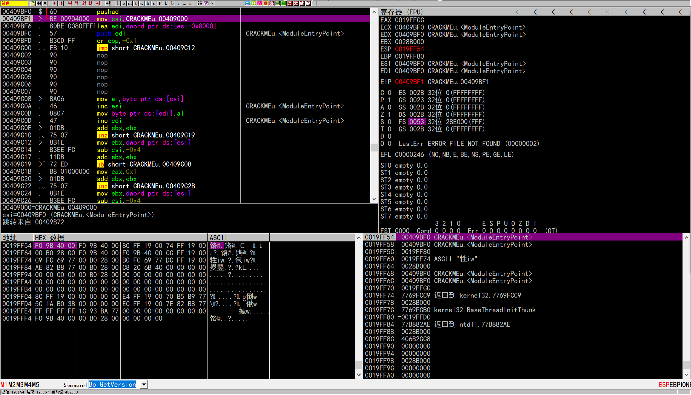

F9执行到jmp指令，F7跟进去就找到了OEP：401000

## 0x01Dump

使用PETools工具，将CRACKMEupx dump出来

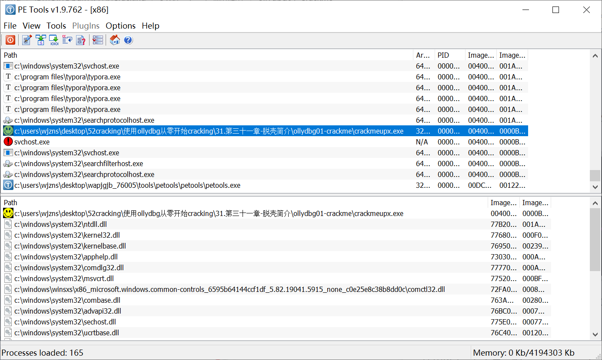

然后发现程序无法正常启动，因为没有修复IAT表。

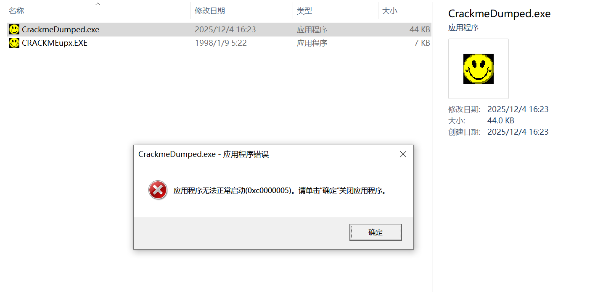

## 0x02修复IAT

这里需要用到Import REConstructor工具，附加到CRACKMEupx进程

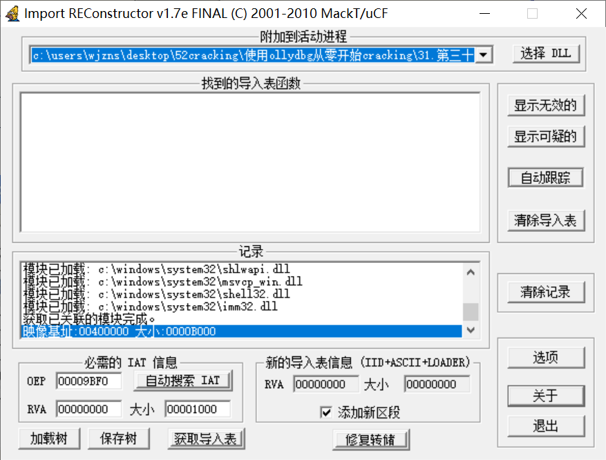

根据提示，我们需要获取OEP，RVA，大小三个信息。

这里我们需要先找到该程序的IAT表，由于API调用通常是通过间接跳转或间接CALL实现的，因此需要在程序中找到类似指令。

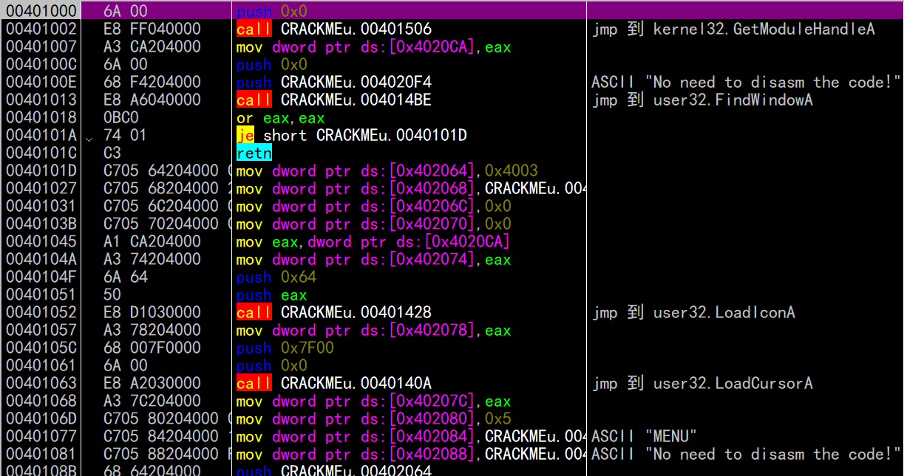

可以看到有user32的，也有kernel32的，这里以kernel32为例，follow进该指令，找到跳转表

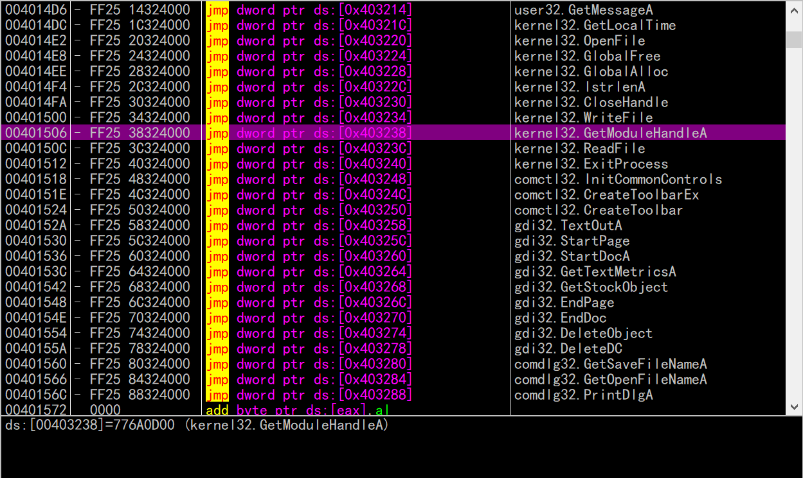

数据窗口中跟随该地址，然后可以看到IAT表

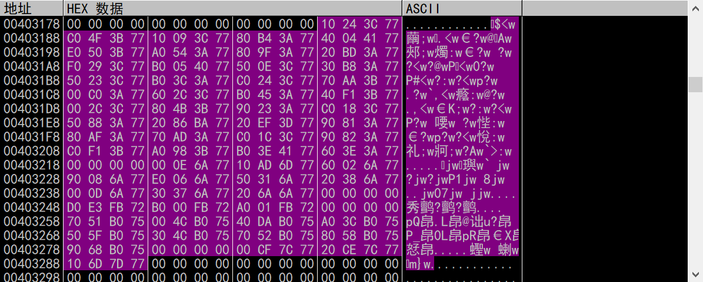

分析一下这些地址都是哪个模块的，可以看到该表由5个部分组成，每个部分由0隔开，先看第一个部分，以773C2410为例，在内存窗口中看看它位于哪个范围。

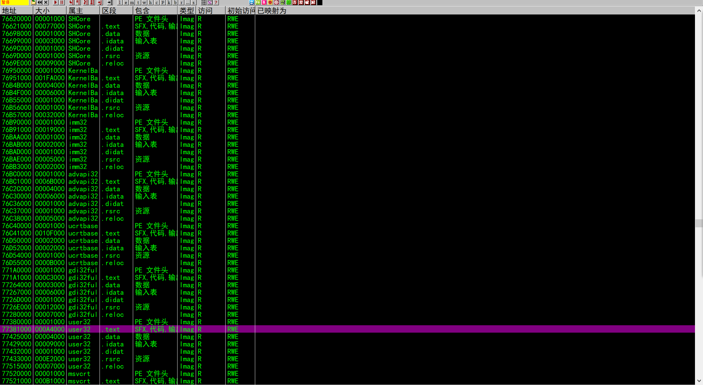

该地址位于77381000开始的大小为A4000的内存区域，对应user32.dll。我们以此类推，得到了这个IAT表中包含的几个模块分别是user32.dll、kernel32.dll、comctl32.dll、gdi32.dll、comdlg32.dll。

分析完了，现在需要向工具中添入几个参数。该表起始位置是403184，结束位置是40328C，大小是108。这里的RVA是403184-映像基址（400000）得到3184。

获取导入表，这里可以看到上面几个模块

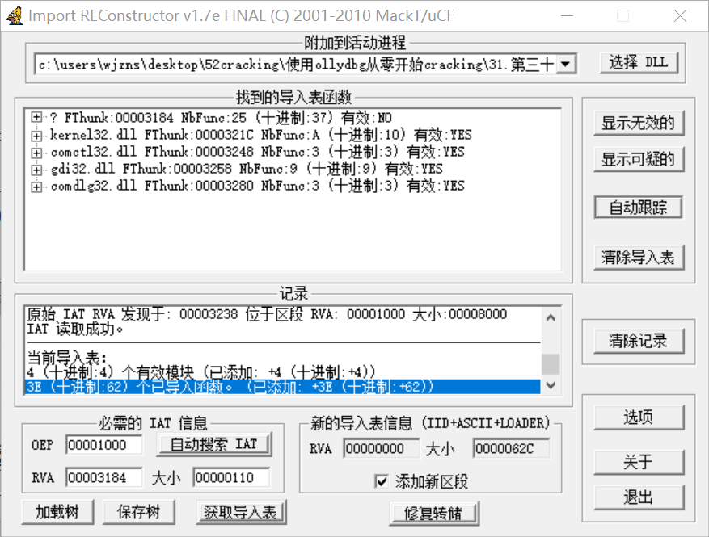

我这里多了一个No，打开该项后发现多了一个ntdll的API，与原教程有些出入，不管它继续往下做。

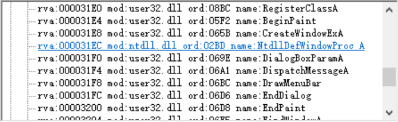

选择修复转储，把上文dumped给修复了

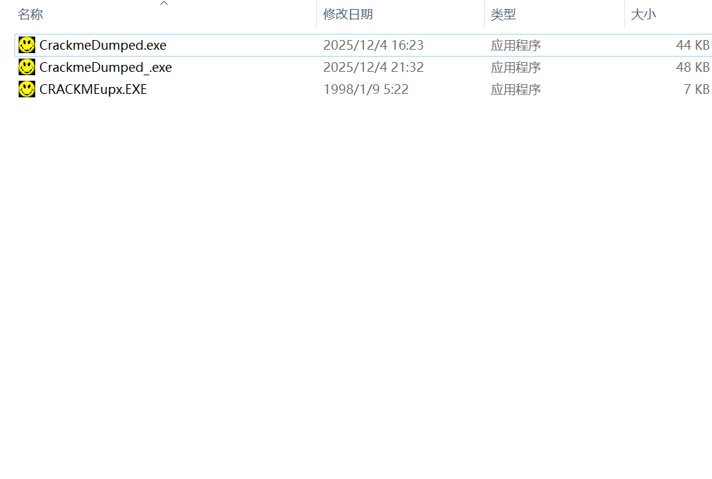

这里也与原教程略有不同，原教程是不能运行修复后的文件，但我这里可以运行

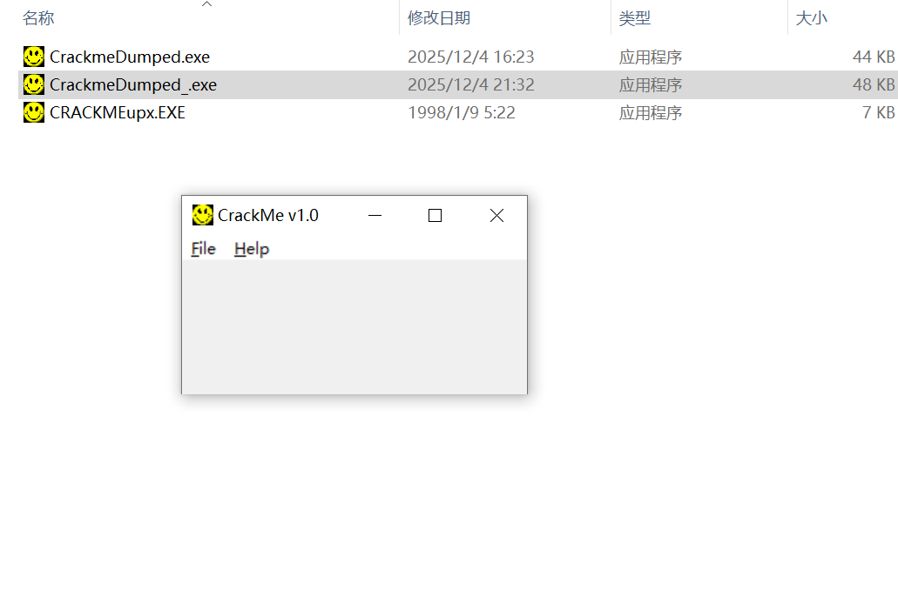

使用PETools rebuild一下，

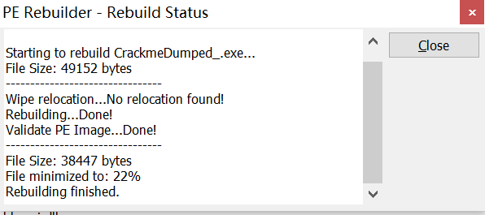

发现减少了10kb

后面还需要改一下PE头

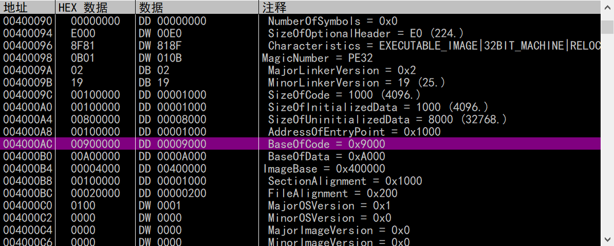

把rebuild后的exe拖到OD中，把BaseOfCode改成0x1000，因为上面AddressOfEntryPoint是0x1000。

之后保存到可执行文件，就完成了本次的脱壳过程。

用OD载入这个程序，在内存窗口中发现了一个新区段.mackt，该区段地址是40B000，数据窗口中转到这里看看发生了什么。

首先是一个IAT表，后边跟着的是IID，再后面是各API名称

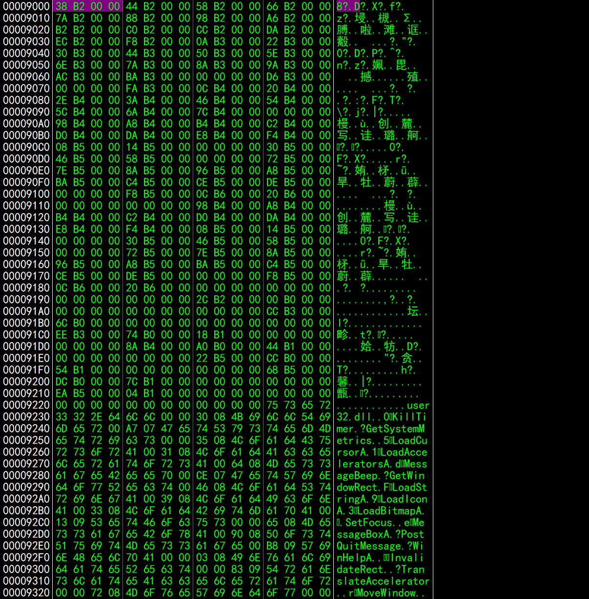
