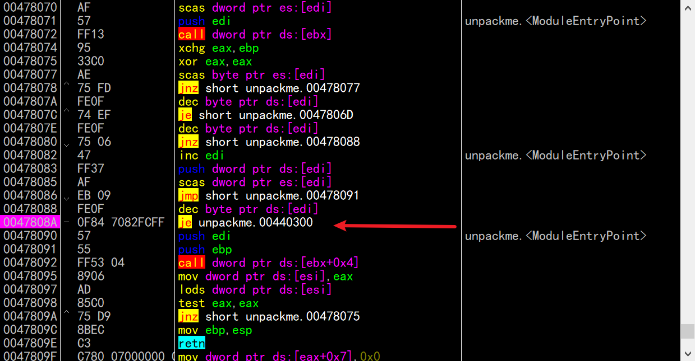
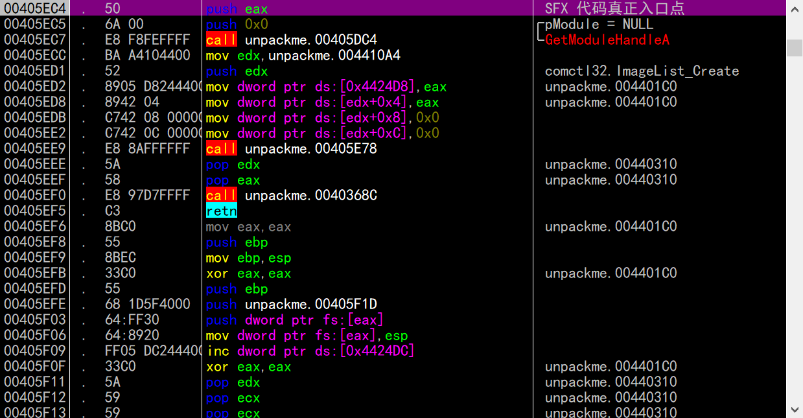
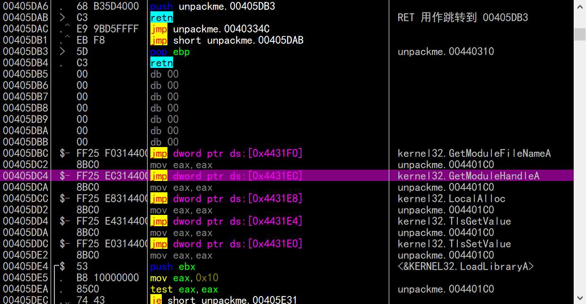
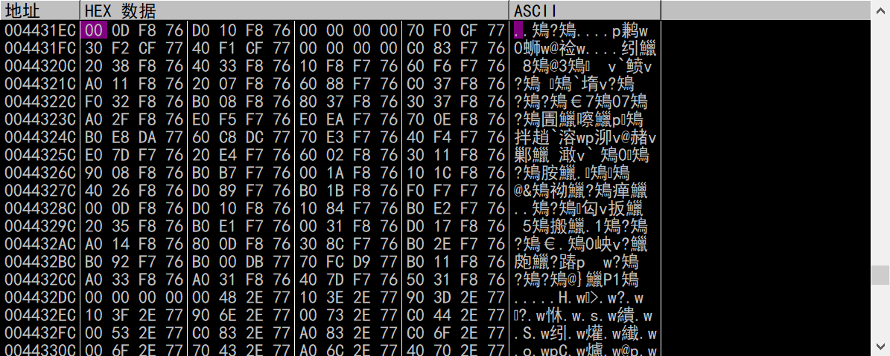
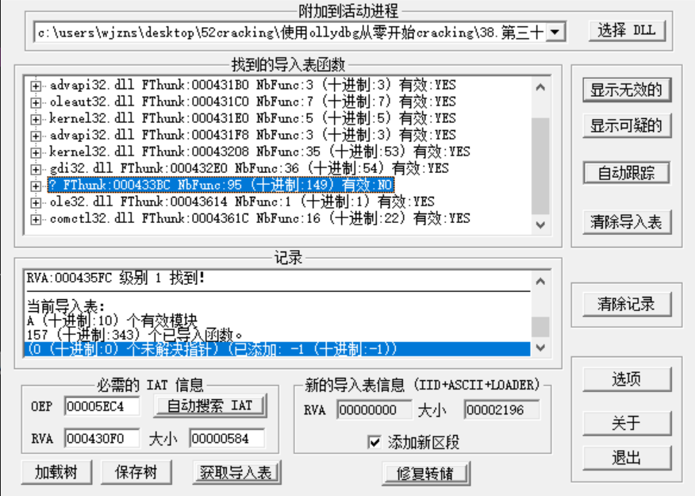
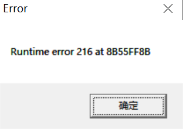

# FSG1.31

## 0x00寻找OEP

内存断点法和ESP定律用不了会被检测。

所以逐行看代码逻辑，发现有一处跳转指令是跨区段的跳转，所以这个地址跟OEP有关

跳转条件是`byte ptr ds:[edi] == 0` 

根据上述条件，给je指令设置条件断点。

程序断下后，再单步几次就到了OEP。

## 0x01Dump

使用ollydump进行dump，这里不再赘述

## 0x02修复IAT

随便找一个Call，这里以GetMoudleHandleA为例。enter进入

然后在数据窗口转到4431EC。

这部分IAT项都是正常的，找到IAT的起始地址4430F0，结束地址443674，大小0x584

把数据喂给ImpREC修复一下。

## 0x03解决报错

运行后发现Runtime error

 因为里面有一些无效项，用ImpREC自带的功能并未成功修复。下面找一下填充IAT的代码

## 0x04手动修复

参考文章：

https://blog.nowcoder.net/n/84cb56f015ea4e5d87b347669684ae51?from=nowcoder_improve