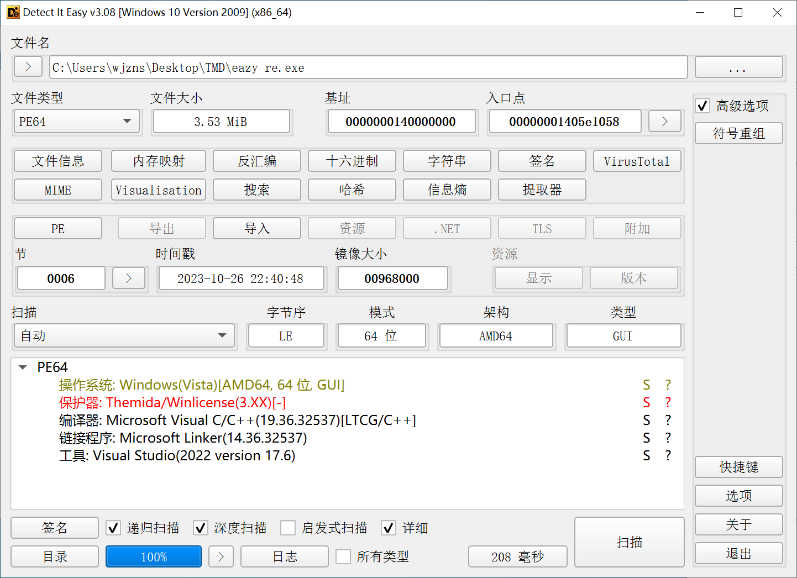
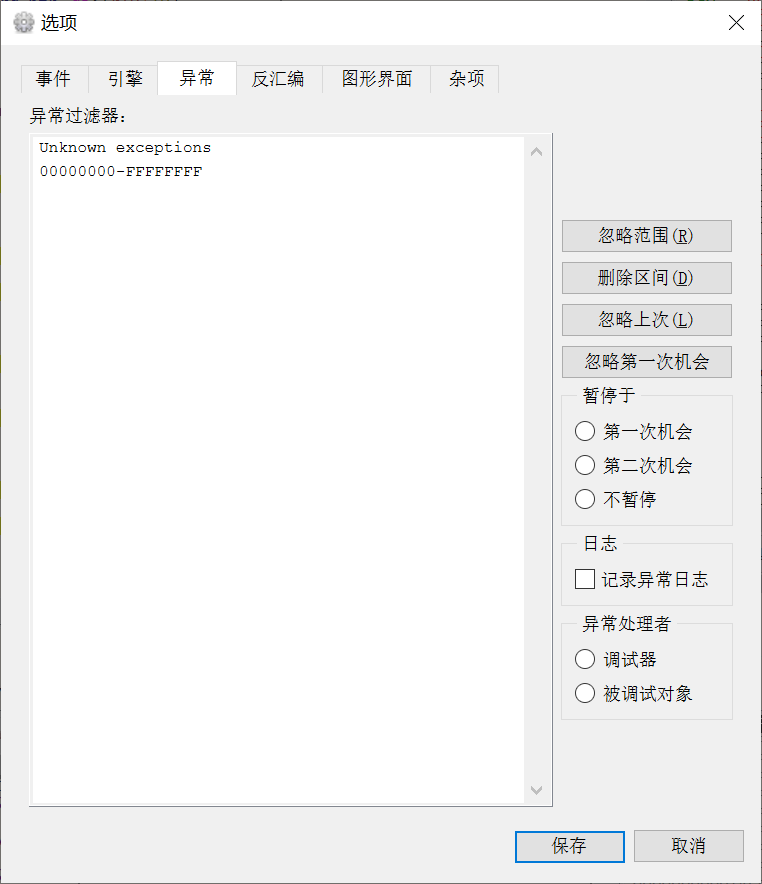
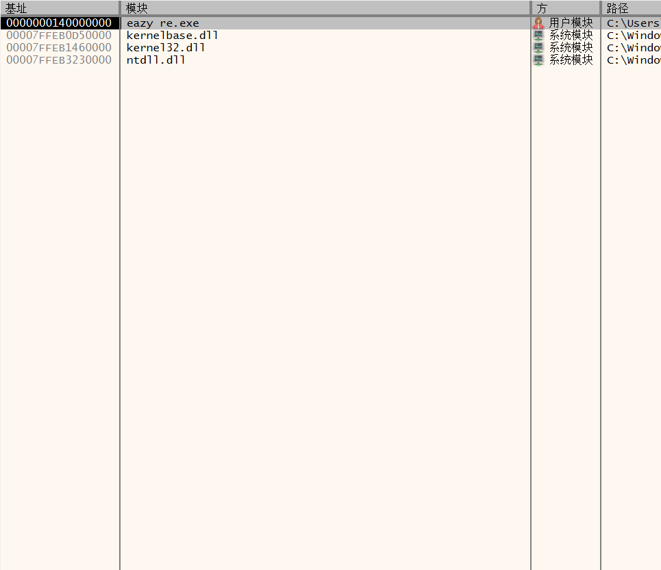
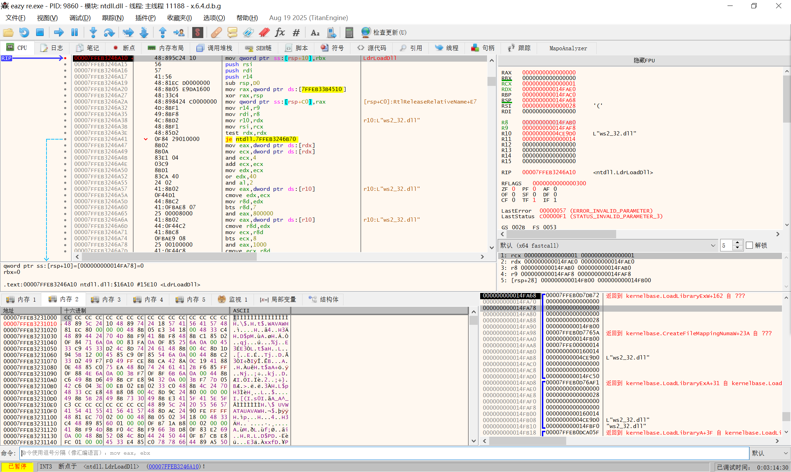
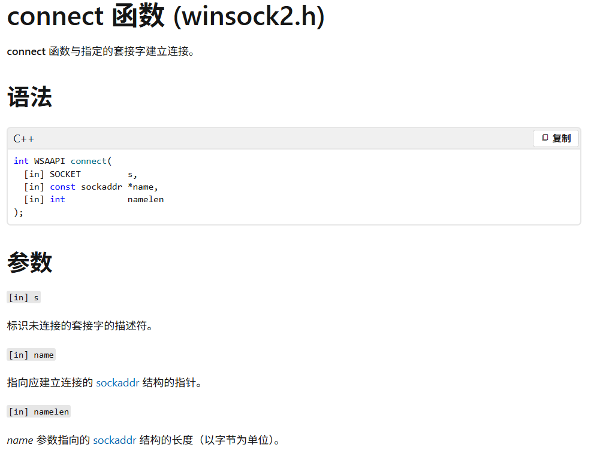
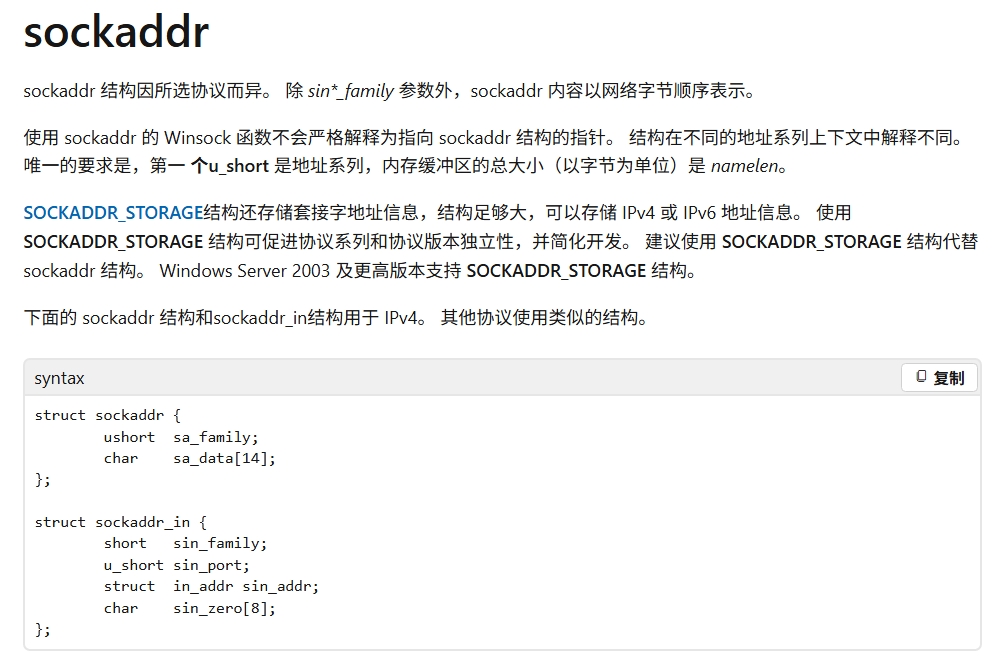

# easy re WriteUp

这是一个后门程序，它会与某个特定ip进行网路通信，需要找出ip和port，可以通过hook connect函数实现

## 0x00 异常处理

由于程序是themida壳，该壳会产生大量异常干扰调试器，所以需要事先忽略异常，范围是00000000~FFFFFFFF

## 0x01 拦截ws2_32dll

由于connect函数是ws2_32.dll的API，而程序刚开始并没有加载这个模块，

所以需要在程序加载它的时候进行拦截。

用于加载dll的API是ntdll的LdrLoadDll，给这个API下断点然后盯着堆栈窗口看看有没有ws2_32.dll。

在按了18次F9之后找到了这个模块，再次按下F9使得ws2_32被加载进来，这样就可以给connect下断点了。

## 0x02 hook connect

删除或禁用上述LdrLoadDll的断点，用bp connect给connectAPI下断点，按F9，成功断在了connect入口处

对我们有用的是第2个参数，这是一个sockaddr结构体的指针，

这个结构体存储了我们需要的port和IP地址。

根据API的参数列表和x64调用约定，这个结构体的指针被存到RDX寄存器中，在内存窗口里转到该地址，

可以看到如图所示数据，前两个字节表示IPv4协议，后面两个字节是端口号，再后面四个字节是ip地址。把它们转换成10进制就得到了flag{152.136.137.115:8085}