# OD/xdbg Notes

### 断点：

#### 软件断点：

当我们设置断点后,OD会将对应指令处第一个字节指令替换成CC。但是为了不影响界面显示效果,OD会将CC显示为原字节。但是,我们可以在内存单元中读取出其真实的内容,并且可以在反调试中用此方法来检测断点。

#### 内存访问断点：

基本原理是通过修改内存页访问属性实现的

OD中的使用：

1. 可以精确断在相应内存地值上
2. 内存断点只能设一个，多了会清除原来的

xdbg中的使用：

1. 不如OD精确，它会断在整个内存页

检测方法：检测内存页的属性并恢复内存页的属性来进行保护,但是这在反调试技巧中并不常见。

#### 硬件断点：

数量限制：最多是4个

范围限制：只断前4个字节

断点位置：触发硬件断点的下一条指令处。

#### 条件记录断点：

我们可以通过设置该断点来记录下设置的条件的精确值。

OD中的条件语法跟汇编一样，不再赘述；

xdbg语法是C-like比较复杂，这里会把遇到的用法记录下来

- byte(addr) == cond  地址addr处的一个字节数据等于cond断下
- Exception address = {[esp + 14]} 用于日志记录，表达式需要用大括号包起来  

#### 消息断点：

如果应用程序并不是通过API函数来获取用户输入的序列号的话,我们可以通过消息断点来定位,这是消息断点的优点。另外，消息断点与普通CC断点的区别在于,普通CC断点在程序启动之前就可以设置,但是对于消息断点来说,只有在窗口创建之后才能够设置消息断点以及拦截消息。

------

## 基本方法：

### 0x00爆破

改汇编代码，发布补丁

### 0x01硬编码序列号

正确的序列号是作为全局字符串出现在程序中的

需要注意一下两点：

1. 成千上万行的程序无法肉眼直接看出序列号
2. 看到的序列号不一定为真，需检验其正确性

## 脱壳步骤：

我们知道当到达OEP后,各个区段在内存中的分布跟原始程序很接近,这个时候我们就可以尝试将其转储到(dump)文件中,完成程序的重建工作(PS:脱壳)。

通常脱壳的基本步骤如下:

### 1:寻找OEP

#### 1)搜索**JMP**或者**CALL**指令的**机器码**(即一步直达法,只适用于少数壳,包括UPX,ASPACK壳)

原理：一般情况下(理想情况)壳在解密完原程序各个区段以后,需要一个**跨段**JMP或者CALL跳转到原程序代码段中的OEP处开始执行原程序代码。

应用：在OD中右键选择Searchfor-ALL Commands，然后对各指令下断

适用范围：简单壳

#### 2)SFX法

应用：Trace real entry blockwise[inaccurate]速度快；Trace real entry blockwise[very slow]速度慢，精确

适用性：入口点位于代码段之外的程序（常见）

#### 3)使用Patch过的OD来定位OEP(即内存映像法)

原理：正常的内存访问断点**读取,写入,执行**的时候都会断下来,该Patch过的OD内存访问断点仅当**执行**的时候才会断下来，因此可以利用这一点来定位OEP

例：

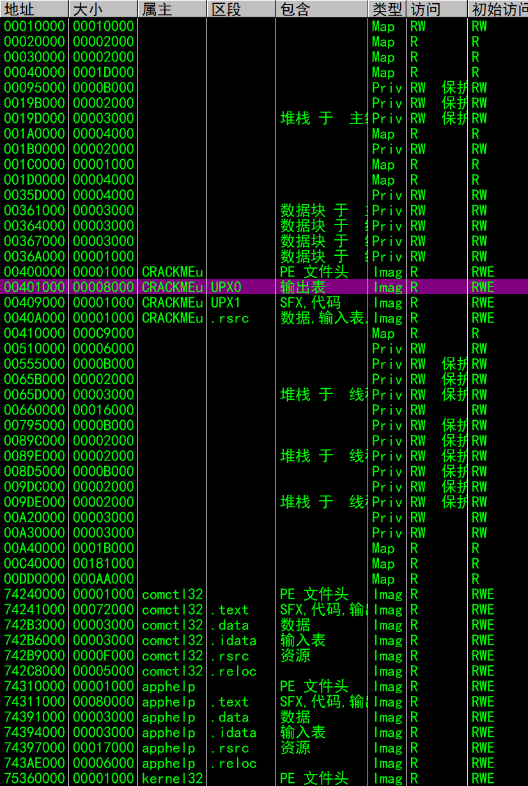

在第一个区段设置内存访问断点，只有程序执行到内存访问断点才会中断，那么就可以找到OEP。如果第一个区段不行，那么就继续给后面的区段设置断点，直到找到OEP

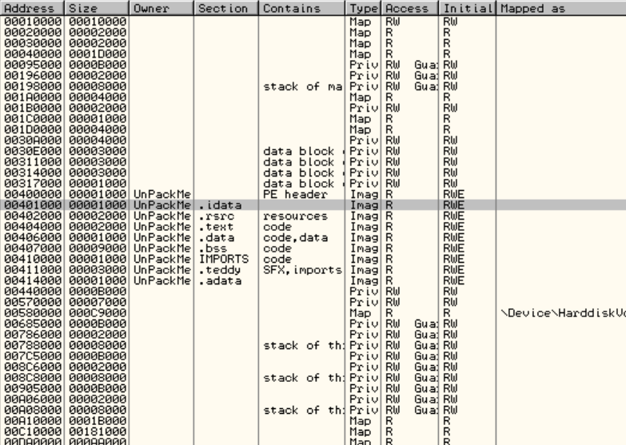

这个例子中，在idata区段设置内存访问断点程序并没有中断，而在text区段设置内存访问断点后程序中断下来

ps：需要研究一下xdbg能不能用到这种方法

#### 4)堆栈平衡法(即ESP定律法)

原理：在解密完区段,跳往OEP之前会恢复寄存器环境，在这是给堆栈顶部的数据设置内存/硬件访问断点就可以定位到OEP附近

应用：找到PUSHAD或PUSH AEX、PUSH EBX等指令。F7单步执行指令，各寄存器的值被压入堆栈，然后对这些初始值(ESP)设置断点。程序试图读取这些值的时候就会断下来，位置在OEP附近。

适用范围：古老的壳

#### 5)VB应用程序定位OEP

#### 6)最后一次异常法

原理：在解密期间程序产生诸多异常，最后一次异常离OEP最近，因此可以定位OEP

应用：先跑起来，在日志里找到位于程序所在区段的最后一次异常，记住这个地址。再跑一次，忽略所有异常，直到停在相应地址。后面，对代码段设置内存访问断点，跑起来后，程序中断在OEP。ps：还有另一种方式，--------------------------------------

壳对内存访问断点的检测：

- 如果我们在离OEP越近的地方设置内存访问断点,就越不容易被壳检测到。

- 为什么不在一开始设置内存访问断点呢?原因是很多壳会检测程序在开始时是否自身被设置内存访问断点,如果执行到了最后一次异常处的话,很可能已经绕过了壳的检测时机

适用范围：解密时产生大量异常的程序

#### 7)利用壳最常用的API函数来定位OEP

比如：GetProcAddress，LoadLibrary，ExitThread......

应用：给GetProcAddress设置条件记录断点，先拿到日志，获取函数返回地址，中断条件：[ESP] == 47009A，最终会断在OEP附近。

适用范围：大多数

#### 8)利用应用程序调用的第一个API函数来定位OEP

直接给应用程序调用的第一个API函数设置断点，对VC++来说第一个API是GetVersion,GetModuleHandleA，断下来后跟进它的返回地址，就会定位到OEP附近。

### 2:转储(PS:传说中的dump)

### 3:修复IAT(修复导入表)

#### 什么是IAT表：

为了解决不同系统上dll版本不同问题，操作系统提供了IAT表确保程序在不同版本的dll下也能正常运行。程序在不同版本操作系统上都是调用间接跳转到IAT表中,在IAT中读取到真正的API函数入口地址,然后调用之

#### 如何定位IAT：

1以MessageBoxA为例，找到主模块中对它的调用，enter跟进，会看到一堆间接跳转。

![image-20251201194224576](OD Notes.assets/image-20251201194224576.png

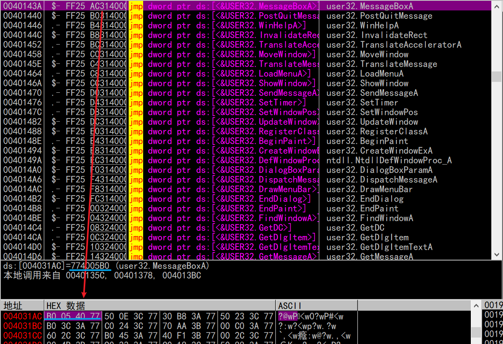

在数据窗口跟随这个跳转，则会看到4013AC这个地址保存了MessageBoxA的地址。类似的，可以看到其他区域也保存了其他函数的地址，那么这个地方就是IAT表。

##### 2IAT填充过程

找到PE文件头下的Import Table Address项

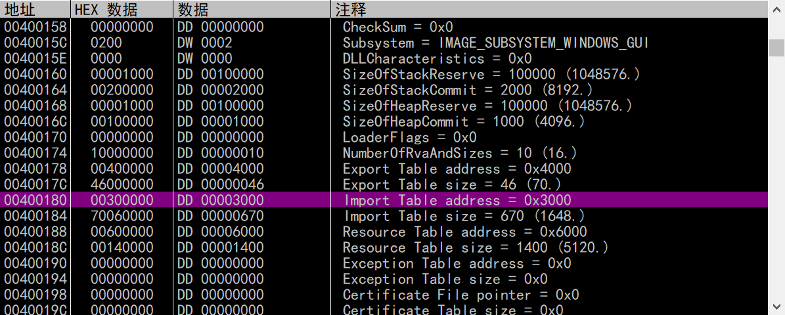

偏移量是3000，在数据窗口中定位到**403000**

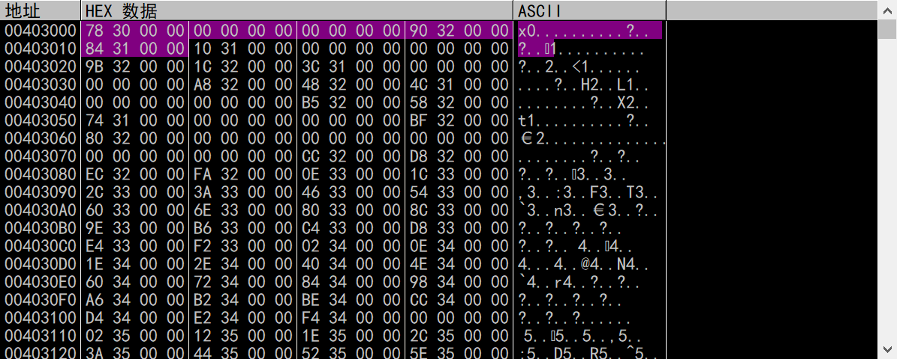

选中的五个DWORD叫IMAGE_IMPORT_DESCRIPTOR，它具有如下结构：

OriginalFirstThunk

TimeDateStamp           时间戳

ForwarderChain           链表的前一个结构

Name1                   		指向DLL名称的指针

**FirstThunk**               	  指向的链表定义了针对Name1这个动态链接库引入的所有导入函数

关键在于Name1和FirstThunk字段，上图中，Name1对应地址是3290，对应403290处是user32.dll，所以FirstThunk自然对应的是user32的IAT起始地址

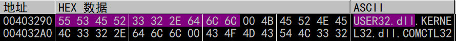

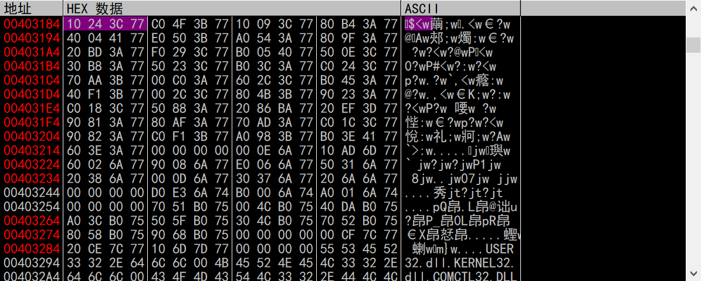

以此类推，后面紧跟的IID则是关于kernel32.dll的。

此外我们根据user32对应IAT表的起始地址773C2410，在可执行文件中定位到相关API的偏移量是32CC

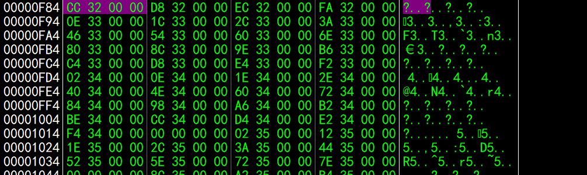

据此定位到4032CC，发现是KillTimer函数

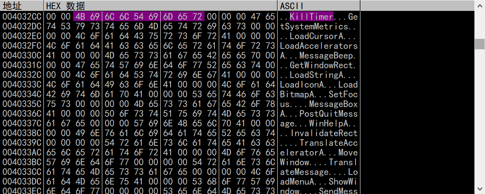

然后系统通过调用GetProcAddress函数获取KillTimer地址773C2410，该地址被填入到403184地址处（见上文）。

再读取IAT的第二个元素773B4FC0

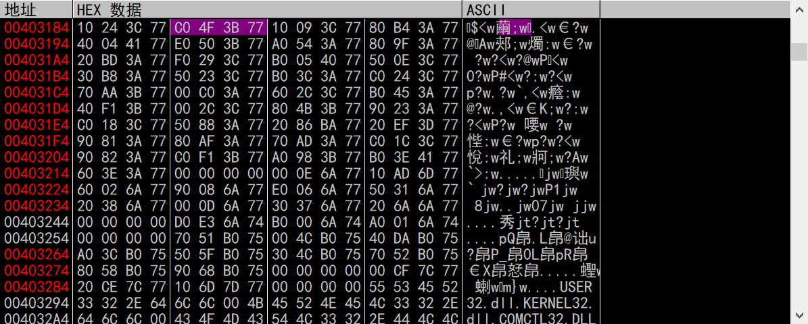

接着定位到可执行文件的偏移处，是32D8，

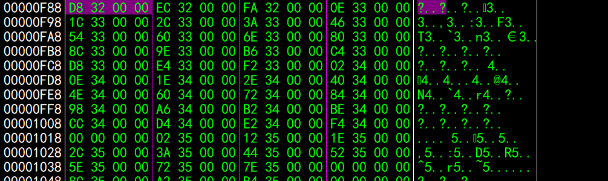

对应的是GetSystemMetrics，定位到它的名称，再次获取它的基址填入到IAT。

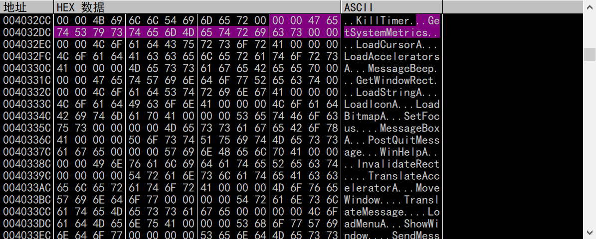

以此类推，直到程序获取完user32.dll的其他API地址遇到IAT为0的项，也就是黄框所示

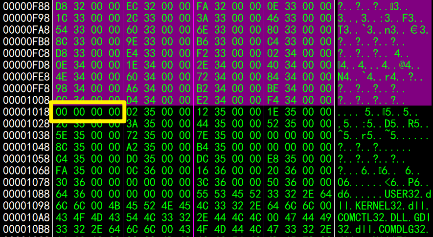

之后程序再找导入表的下一个IID，就是kernel32的IID，后面的步骤与上文类似，不再赘述。

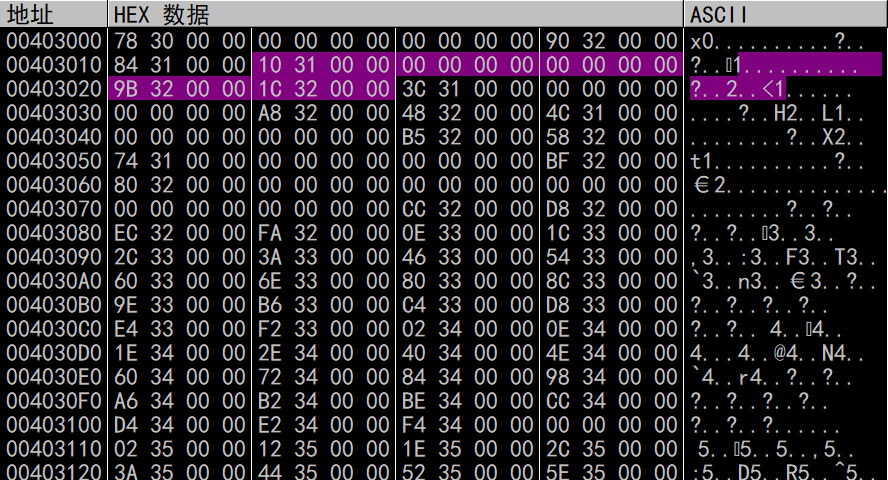

这就是IAT的填充过程

#### 对填充过程的简单总结

在可执行文件中查看这个地址，

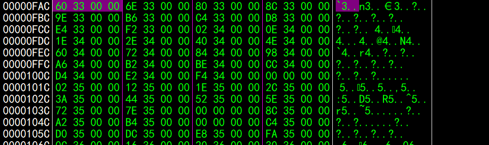保存的是3360，这是一个RVA（相对虚拟地址)，操作系统可以根据这个**指针**,定位（RVA+映像基址)到相应的API**函数名称**,然后通过调用GetProcAddress获取对应API函数的**地址**,然后将该地址填充到IAT中,覆盖原来的3360。

##### 为了确保操作系统将正确的API函数地址填充到IAT中,应该满足一下几点要求:

1:可执行文件各IAT项所在的文件偏移处必须是一个指针,指向一个字符串。

2:该字符串为API函数的名称。

#### 为什么要修复IAT

因为壳将IAT函数名称对应的字符串加密，存到某个不易被发现的地址处。程序运行的时候会先执行解密流程，读取IAT中所需要的API的名称指针,然后定位到API函数地址（GetProcAddress）,将其填入到IAT中,这个时候,IAT中已经被填充了正确的API函数地址,对应的API函数名称的字符串已经不需要了,可以清除掉。

#### IAT重定向及其修复


### 4:检查目标程序是否存在AntiDump等阻止程序被转储的保护措施,并尝试修复这些问题。


### 调用约定

在 64 位 Windows 程序中，函数的前 4 个整数/指针参数**不是**压入堆栈的，而是依次存放在寄存器中：

- 第 1 个参数 -> **RCX**
- 第 2 个参数 -> **RDX**
- 第 3 个参数 -> **R8**
- 第 4 个参数 -> **R9**

例：

对于ws2_32.dll中的connect函数

```c
int connect(

 SOCKET     s,    // 第1个参数 (RCX): Socket句柄 (我们不关心)

 const sockaddr *name,  // 第2个参数 (RDX): 指向地址结构体的指针 (关键！)

 int       namelen  // 第3个参数 (R8):  结构体长度

);
```

第二个参数是指向地址结构体的指针，其中包含了ip和port，而它被存放在rdx寄存器中


在内存窗口转到该地址，可以看到如图所示数据，前两个字节表示IPv4协议，后面两个字节是端口号，再后面四个字节是ip地址


###### 参考文献：

看雪论坛：《使用OD从零开始Cracking》

