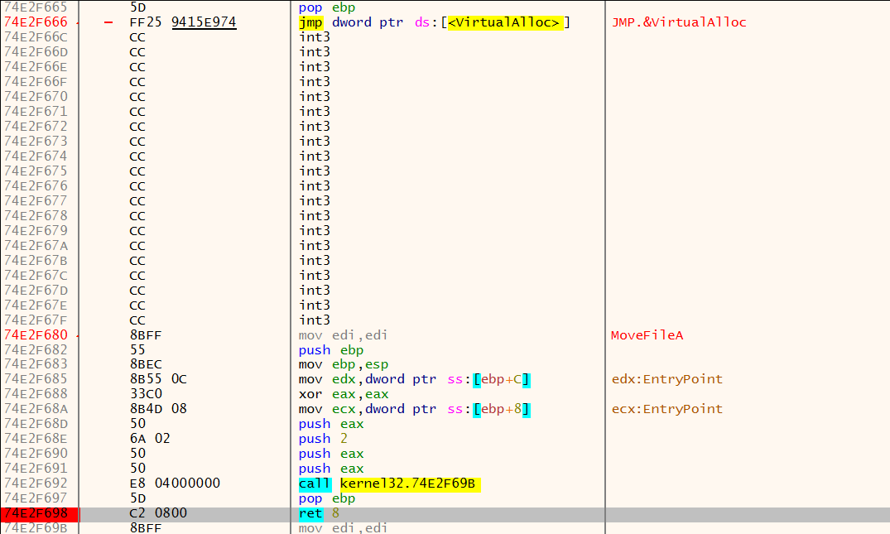

# IAT重定向——以tElock0.98为例

## 0x00：定位入口点

### 首先尝试ESP定律法

在入口处F7单步

找到pushad指令，单步，ESP显示的地址是0019FF54，在内存窗口中跟到这个地址，给其中前四个字节设置硬件访问断点

结果被程序检测到硬件断点，下面我们换一个方法

### 最后一次异常法

先在选项-异常里添加00000000-FFFFFFFF范围，本次不暂停

然后重启xdbg，清空日志窗口，让程序跑起来，以便找到最后一次异常的位置。

查看日志窗口，最后一次异常发生在004667F6这个位置。这次把异常那里改为暂停于第一次机会，然后重启。

一直按F9，直到程序停在004667F6这个位置，之后在内存布局窗口，给第一个区段设置内存访问断点

F9跑起来，就到达了OEP

## IAT重定向

在内存窗口中转到460ADC这个api调用，发现其地址是022F06F7

F7跟进这个函数

来到了02开头的部分，在内存窗口中看一下

发现不属于任何一个模块，说明这个地址被重定向了。

然而，如果我们重启的话就找不到这个02开头的区段，说明是壳创建的区段。我们来看看是说明时候被创建的，给VirtualAlloc设置一个断点。

结果跑起来直接结束了，这个断点说明会被程序检测。

我们转到VirtualAlloc，在它的retn处设置断点