# IAT重定向——以tElock0.98为例

## 0x00：定位入口点

### 首先尝试ESP定律法

在入口处F7单步

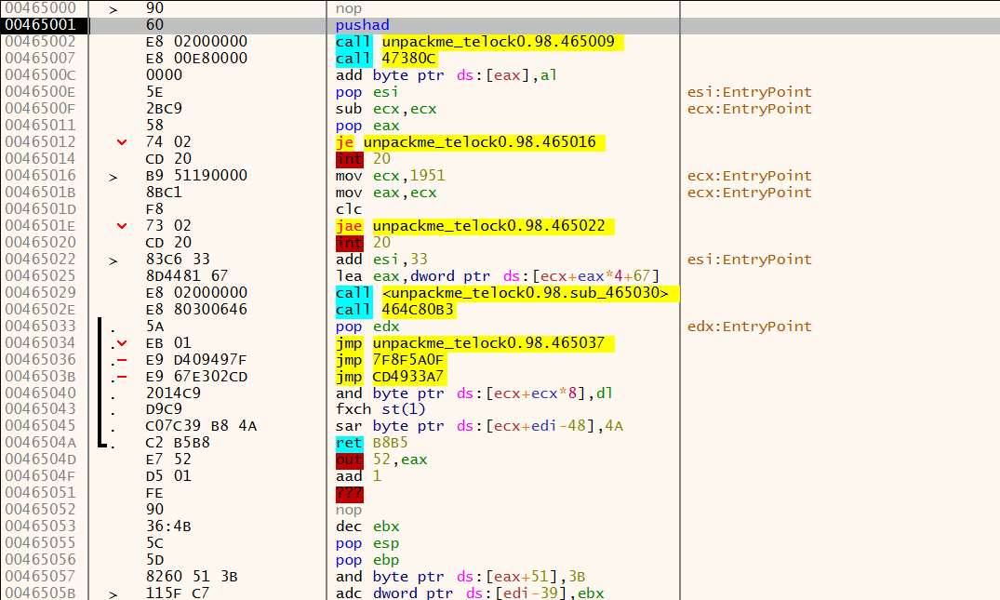

找到pushad指令，单步，ESP显示的地址是0019FF54，在内存窗口中跟到这个地址，给其中前四个字节设置硬件访问断点

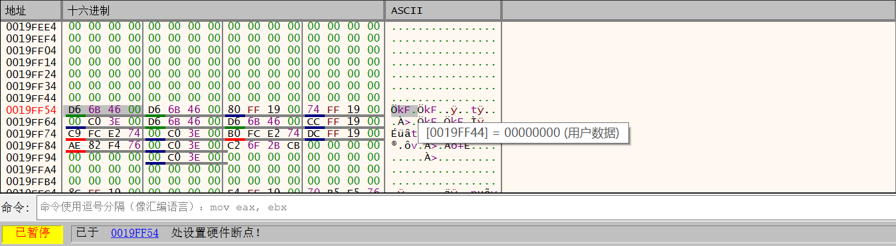

结果被程序检测到硬件断点，下面我们换一个方法

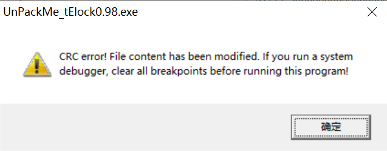

### 最后一次异常法

先在选项-异常里添加00000000-FFFFFFFF范围，本次不暂停

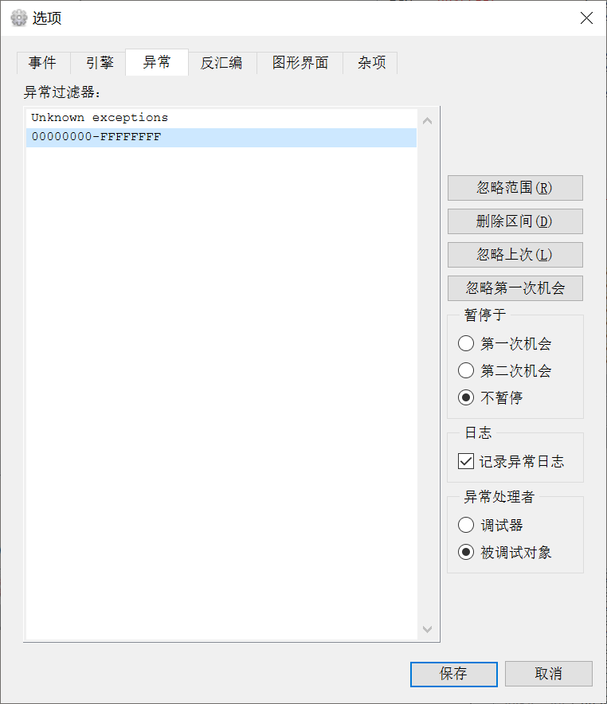

然后重启xdbg，清空日志窗口，让程序跑起来，以便找到最后一次异常的位置。

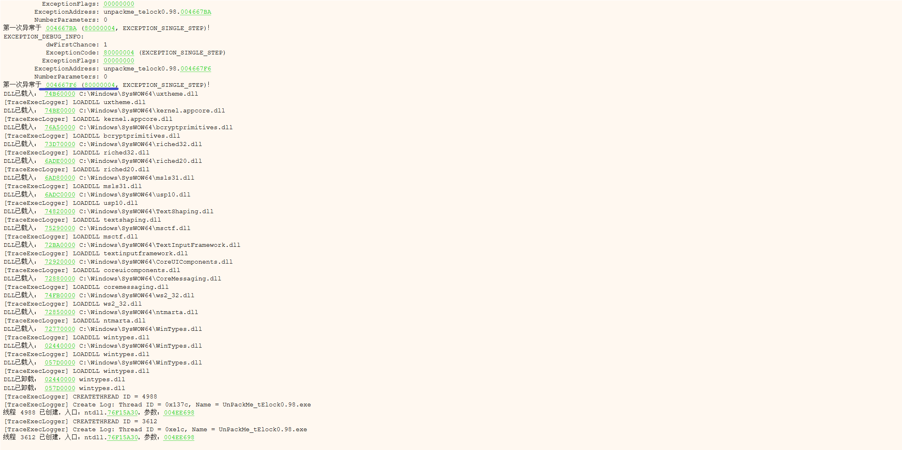

查看日志窗口，最后一次异常发生在004667F6这个位置。这次把异常那里改为暂停于第一次机会，然后重启。

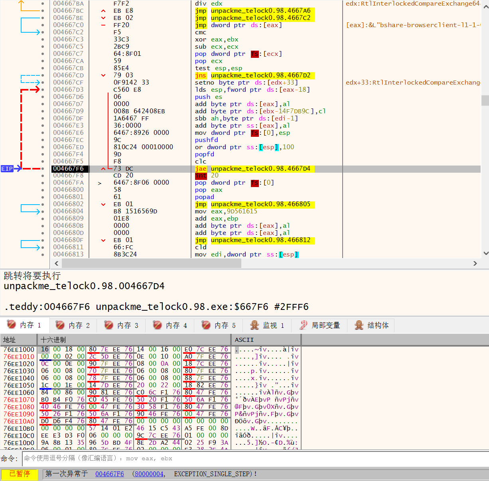

一直按F9，直到程序停在004667F6这个位置，之后在内存布局窗口，给第一个区段设置内存访问断点

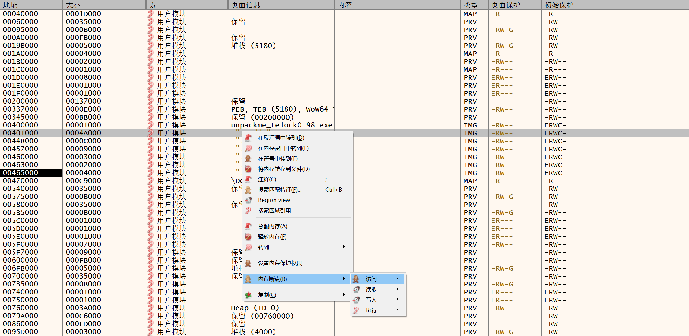

F9跑起来，就到达了OEP

## 0x01IAT重定向

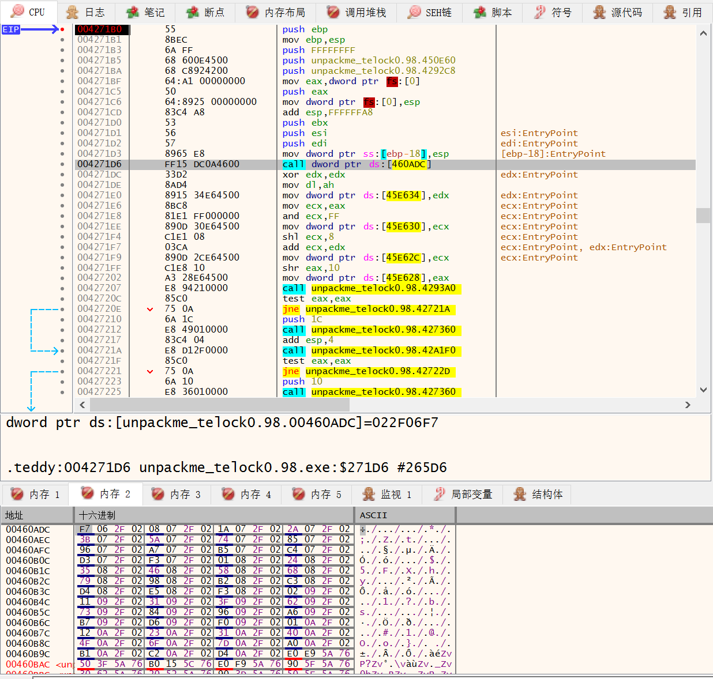

在内存窗口中转到460ADC这个api调用，发现其地址是022F06F7

F7跟进这个函数

来到了02开头的部分，在内存窗口中看一下

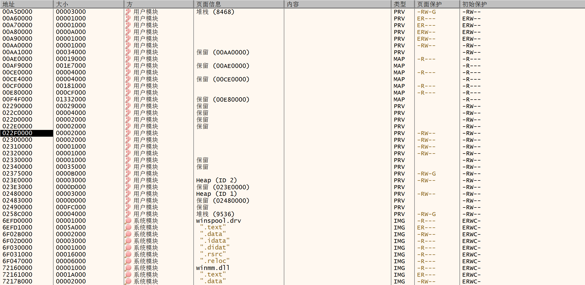

发现不属于任何一个模块，说明这个地址被重定向了。

然而，如果我们重启的话就找不到这个02开头的区段，说明是壳创建的区段。我们来看看是说明时候被创建的，给VirtualAlloc设置一个断点。

结果跑起来直接结束了，这个断点说明会被程序检测。

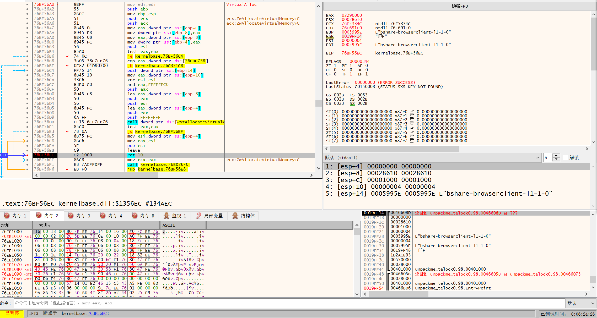

我们转到VirtualAlloc，在它的retn处设置断点。F9后断了下来，其中eax的值是02290000，并且我们能够在内存布局窗口里找到这个区段。

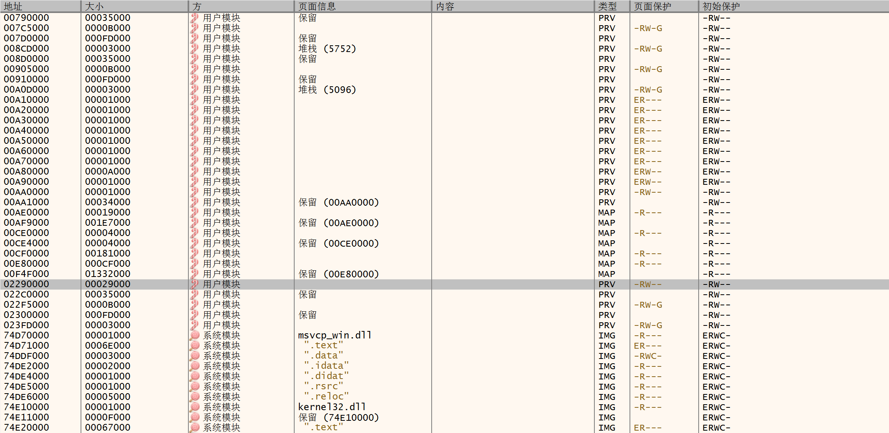

之后我们继续把程序运行到入口处。

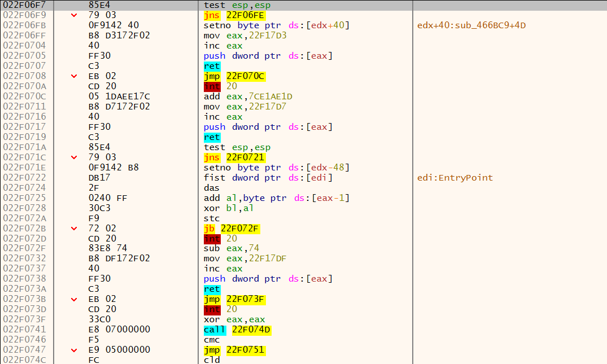

进入api后发现起始地址是022F开头的，正好是刚才开辟的那块内存

综上所述，壳先用VirtualAlloc开辟一块以02290000为起始地址的内存，然后把IAT中的api地址替换为这块内存中的地址，这就是所谓的重定向。

## 修复IAT

找到这块IAT的起始地址和结束地址

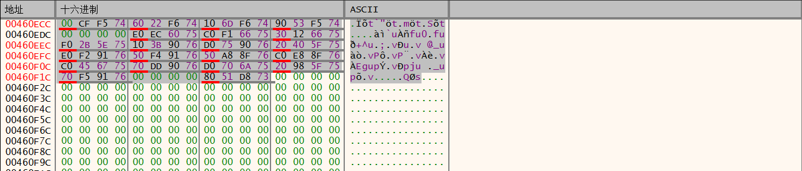

这里起始地址是460818，结束地址是460F28，大小xdbg已经帮我们算出来了是710，把这些数据填到ImportREC中。

### 手动修复：

找到无效项，以406ADC对应的api为例

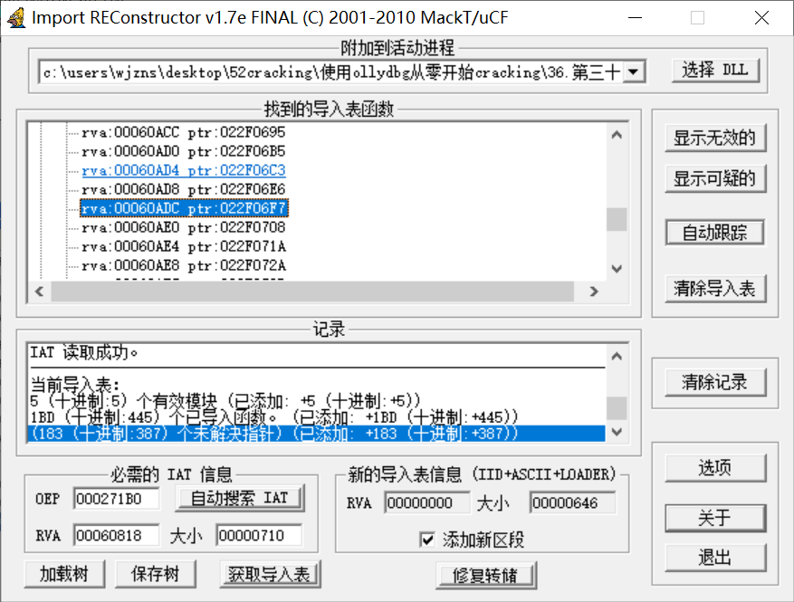

无论壳怎么重定向，最终的api地址一定位于系统模块中，也就是可以在内存布局里查到它是哪个dll的，而不是像现在这样位于壳区段中。因此可以跟踪api，看看最终它的入口地址在哪里。

这里有几种常用跟踪方法

1EIP位于系统DLL区段时停止追踪

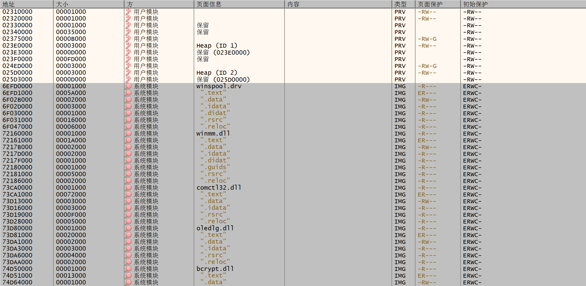

我的内存布局里显示从6FFD0000开始就是系统区段了，所以设置如下条件`eip >= 6EFD0000 && eip <= 7FFFFFFF`后就断在了GetVersion的跳转处

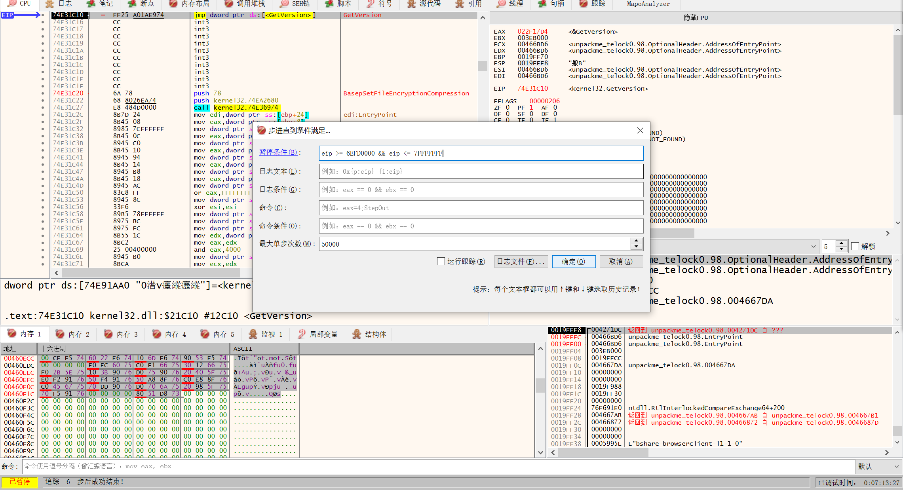

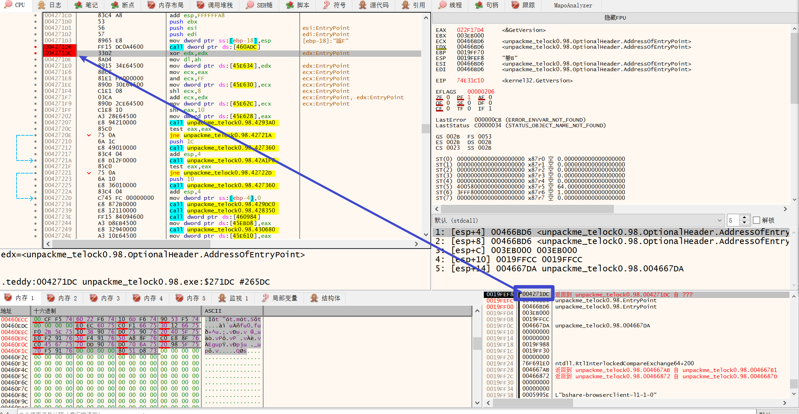

然后我们可以看到返回地址确实是下一条指令的地址，这说明我们找对了

除此之外还有其他几个条件也可以控制跟踪范围

2EIP位于主程序区段外停止追踪

3栈顶指针是下一条指令的地址，即返回地址，同时EIP是0C3（ret指令的十六进制是C3）

byte(eip) == 0C3 && [esp] == 4271DC

（经过本人不断摸索，终于找到了正确的语法）

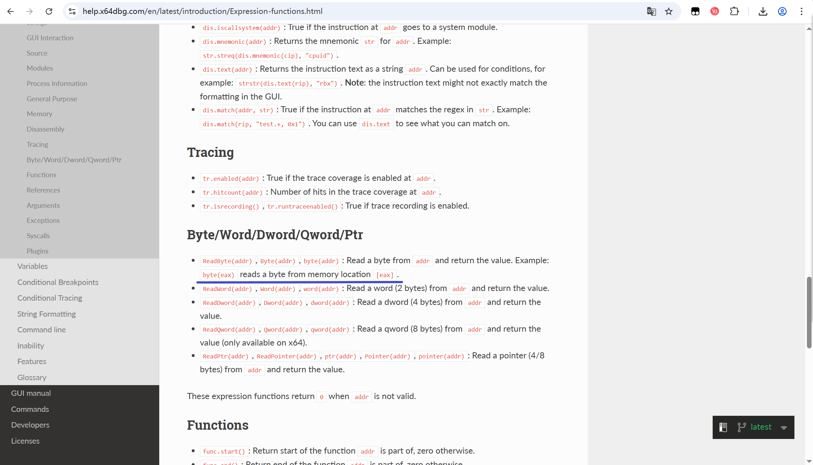

因此我们知道了上边这个api是GetVersion
