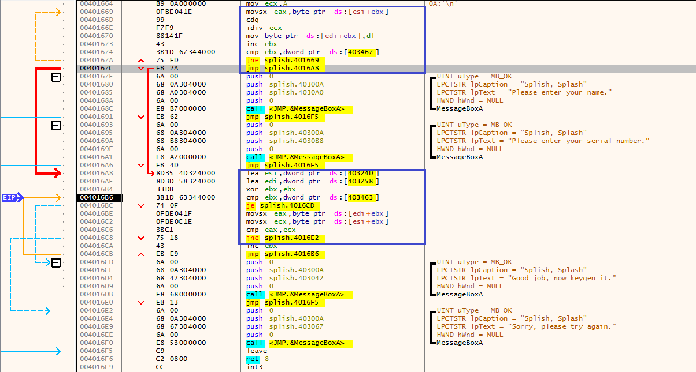
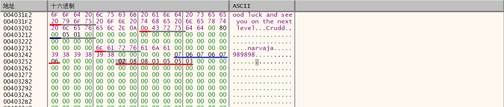
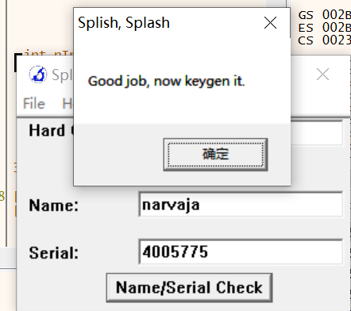

# Splish

# 0x00准备工作

根据前几章的内容，在GetWindowTextA下断点后，根据函数参数找到名称（narvaja）和序列号（989898）的缓冲区地址，对序列号第一个字节设置硬件断点，跳转到如下代码。

# 0x01算法分析

序列号每一位mod 0A，结果存在区间[40324D(esi),403258(edi)]；

取模运算结果即余数，与一段写死的数值比较

不同，则跳转到失败对话框。相同则跳转到Goodjob对话框。

我们输入的序列号是989898

从9开始，根据ASCII码表，9对应39，所以：

39 = 5*A + 7

这是正向运算的方法，现在需要逆向计算才能得到正确序列号。

# 0x02逆向求解

从第一位开始5 * A + 2 = 34 =>4

第二位5 * A + 8 = 3A =>;

发现是分号，超了，根据同余关系，可以把上式换成

4 * A + 8 = 30 =>0

第三位也是0

第四位是5

第五位、第六位是7

第七位是5

综上，narvaja对应序列号是4005775。

我们删掉所有断点，把正确的序列号输进去。

成功！

- 难道这就结束了？

- No！

IDA启动

-----未完待续-----