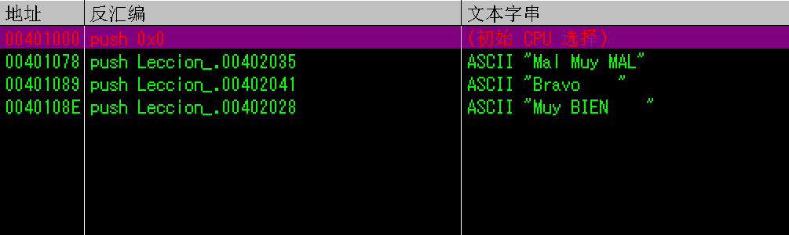
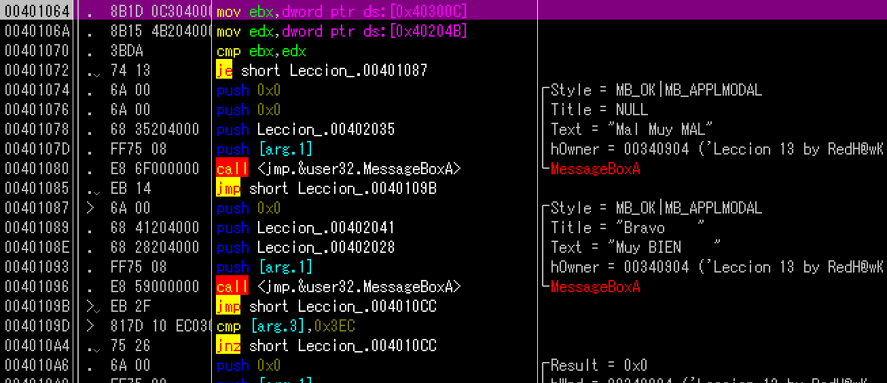
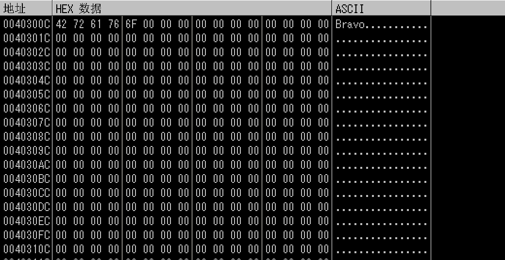
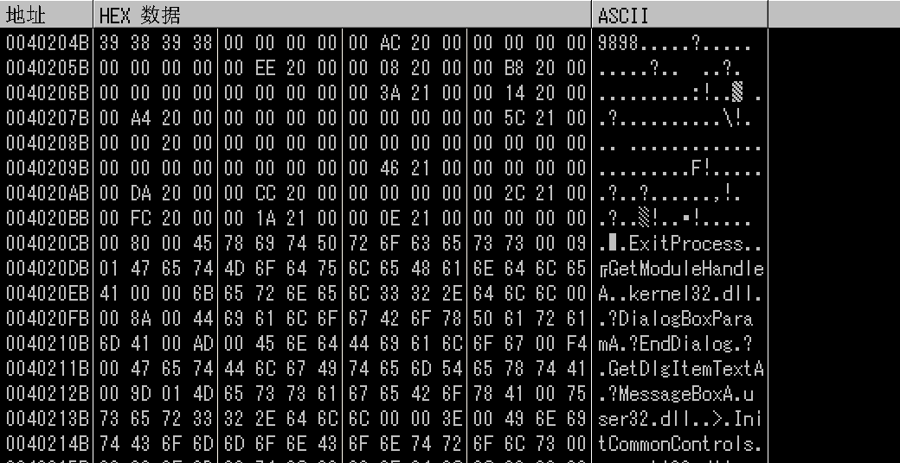
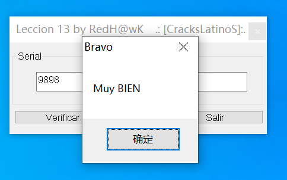

# Leccion_13_HARDCODED_2

原理与Leccion_13_HARDCODED_1相同（以下简称1）。

首先查找参考文本字串，看到Bravo，检验其正确性。

依据1中方法，输入序列号“Bravo”后，在MessageBoxA和GetDlgItemTextA上设置断点，找到比较和跳转指令。

该指令比较了40300C和40204B中前四个字节的值，在数据窗口中跟随。

###### 40300C：

###### 40204B：

如果我们输入的序列号的前四个字节与9898一样，则跳转到401087，弹出正确消息框，不相等弹错误消息框。重启OD，输入9898。

破解成功