# crakmeeasy

ctrl + N查看API列表，对两个熟悉的函数“GetDlgItemTextA”和“MessageBoxA”设下断点。

F9运行，随便输入一个序列号并单击check。

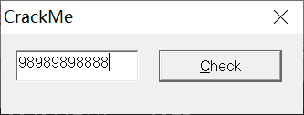

程序断在GetDlgItemTextA，从堆栈窗口中可以看到

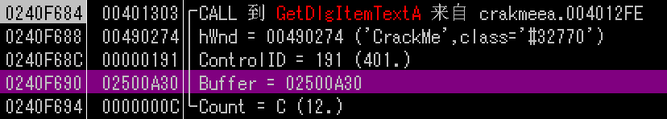

我们输入的序列号将要存储在“02500A30”地址，在数据窗口中跟随，执行到返回并按F7回到主程序，可以看到我们的序列号保存到该缓冲区

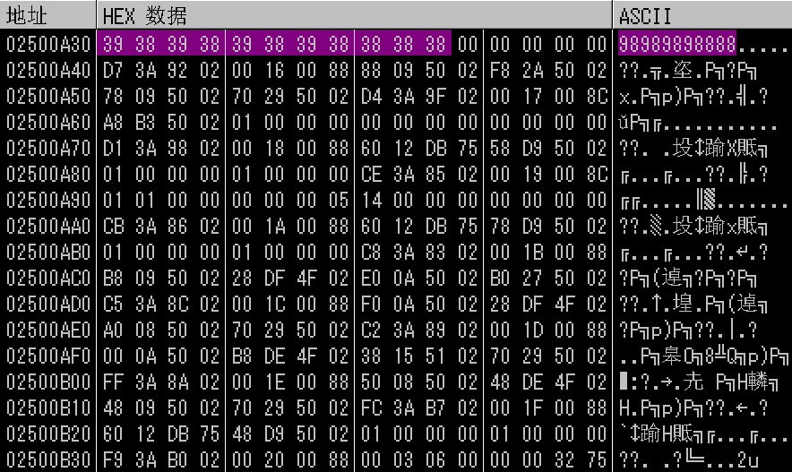

接下来看看程序时如何对序列号进行处理的。

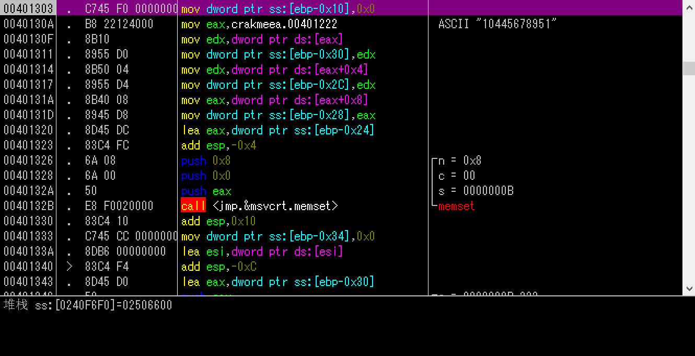

我们看到一个字符串10445678951，该字符串可能和序列号有关。

首先程序将字符串保存到eax中

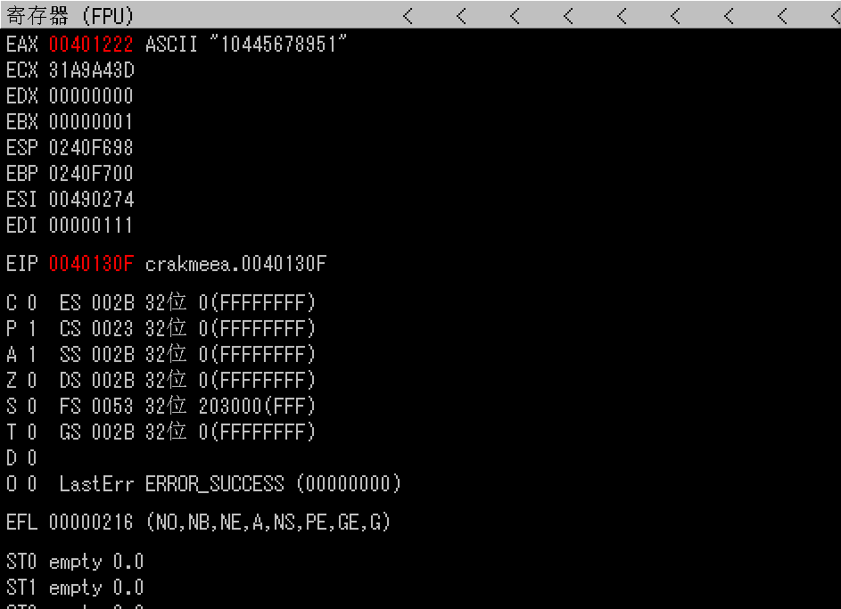

然后，下面黄框处代码是将eax中的字符串4个字节为一组，依次存到指定内存地址

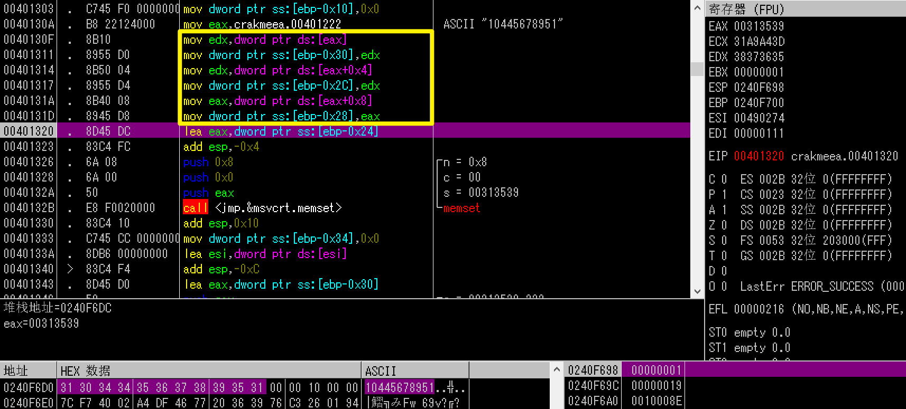

之后lea指令将字符串尾部地址存到eax中

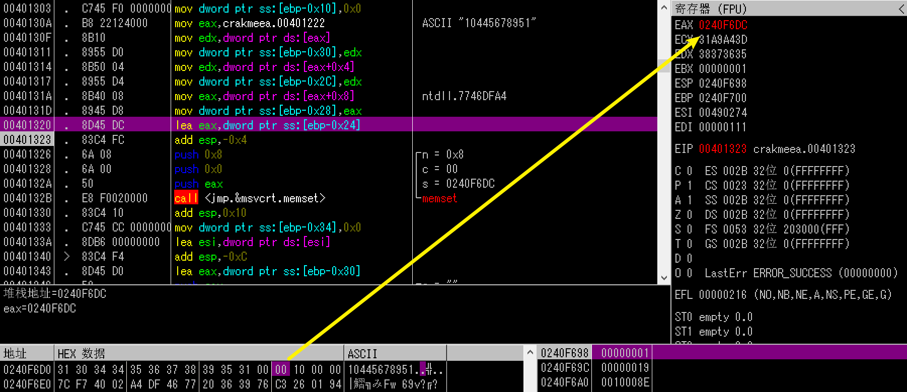

以上是对字符串的存储。

后面调用memset函数，有三个参数

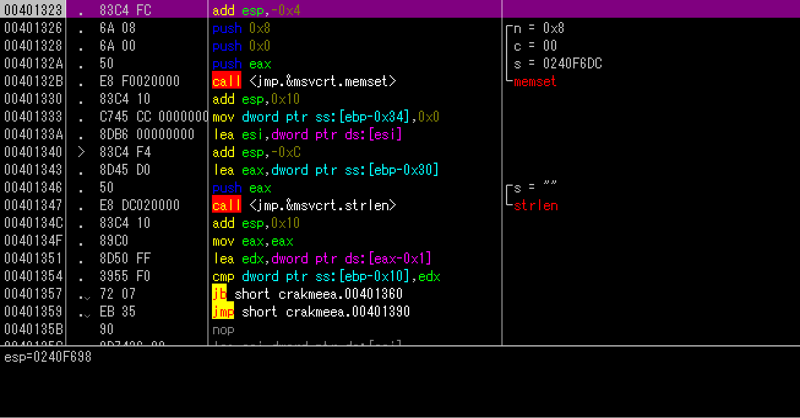

分别是n（需要填充的字节数），s（待填充内存单元的起始地址）和c（待填充的值）。

F8步过该函数，可以看到字符串后面8个字节都被0填充。

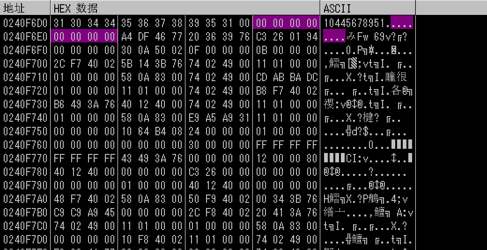

后面是lstrlen函数，用于计算字符串的长度

得出长度为11，被保存在eax中

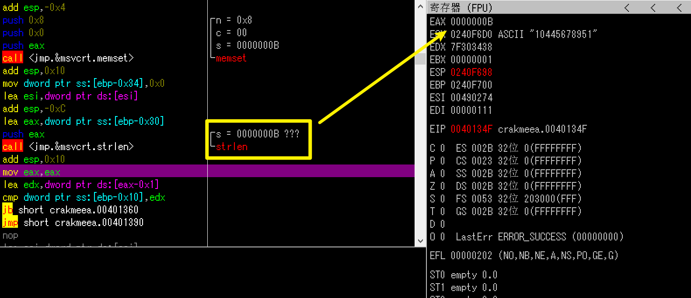

这里将eax-1后得到的0A保存在edx中；

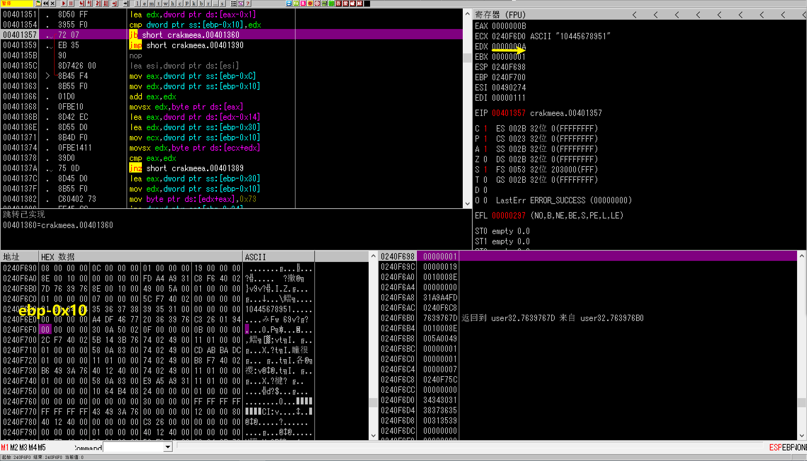

接着比较edx（0A）与[ebp-10]（0）的大小，如果0小于0A，则跳转到401260，否则跳转到401390；

跳转到401360后，将我们输入的序列号的首地址保存在eax；

之后将错误的序列号与0A相加，得到序列号首地址，保存在eax中；

相加eax与edx；

将序列号第一个字节保存到edx中；

**将该字节减去0x14，结果保存在eax中；**

将序列号”10445678951“的首地址存储到edx；

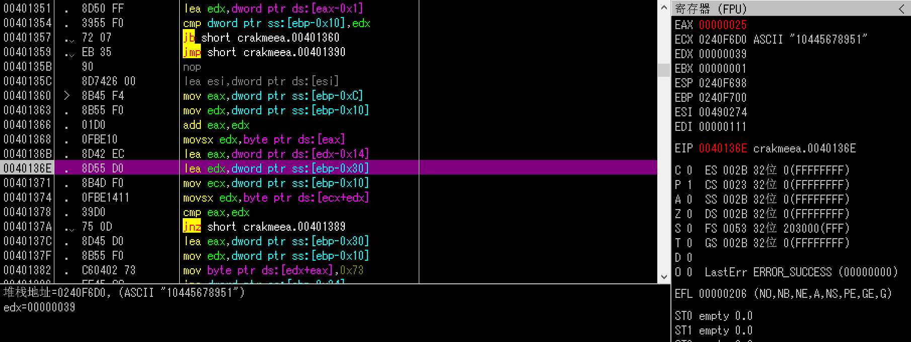

将ecx（循环变量）置0；//后面ebx-10每次会增加1，因此ecx每次增加1，所以是循环变量

将序列号第一个字节存到edx，再比较eax（25，即错误序列号第一个字节减去0x14得到）与edx的第一个字节对应的值（序列号中的1）

结果不等，跳转到401389，ebp-0x10地址的值+1，即开始第二个字节的比较；

因此，从上面的分析中可以知道：正确序列号每个字节 - 0x14 = 10445678951

由此计算可得

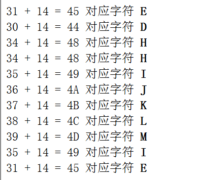

正确序列号如下：

EDHHIJKLMIE

把他输入到CrackMe中，提示正确

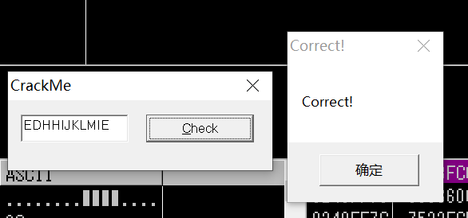

