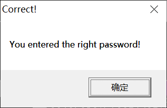

# mielecrackme

## 0x00

首先查找参考文本字串，发现cannabis可能为序列号，以下开始验证是否正确。

作者提示到，lstrcmpA这个函数会直接进行字符串的比较，直接ctrl+N搜索这个函数并设置断点

F9运行，输入cannbis，点击check，程序断在了IstrcmpA，而在堆栈窗口中，注意到函数的两个参数，string1是我们输入的序列号，string2是最开始出现的

说明cannabis可能是正确的。

执行到返回后F7，找到跳转指令

由于eax值为1，或运算后0标志位为0，所以发生跳转，弹出错误窗口。如果我们输入cannabis呢？

可以看到此时eax为0，Z标志位为1，不发生跳转，弹出正确窗口，由此可见，cannabis时正确的序列号。

